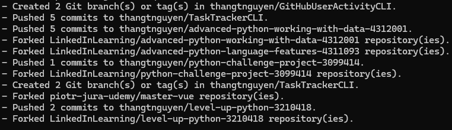

# GitHub User Activity CLI

Project Task URL: https://roadmap.sh/projects/github-user-activity

This project is implemented by using .NET 8 Console App solution.

Task Tracker is aa simple command line interface (CLI) to fetch the recent activity of a GitHub user and display it in the terminal.

## Features

- Provide the GitHub username as an argument when running the CLI:

```bash
github-activity [username]
```

- Fetch the recent activity of the specified GitHub user using the GitHub API. The following are the examples:
  

## Setup

Follow the below steps:

1. Clone this repository:
   ```bash
   git clone https://github.com/thangtnguyen/GitHubUserActivityCLI.git
   ```
2. Navigate to the TaskTrackerCLI directory:
   ```bash
   cd GitHubUserActivityCLI\github-activity
   ```
3. Build the project:
   ```bash
   dotnet build
   ```
4. Navigate to the bin\Debug\net8.0 to run the app.
   ```bash
   github-activity [username]
   ```
